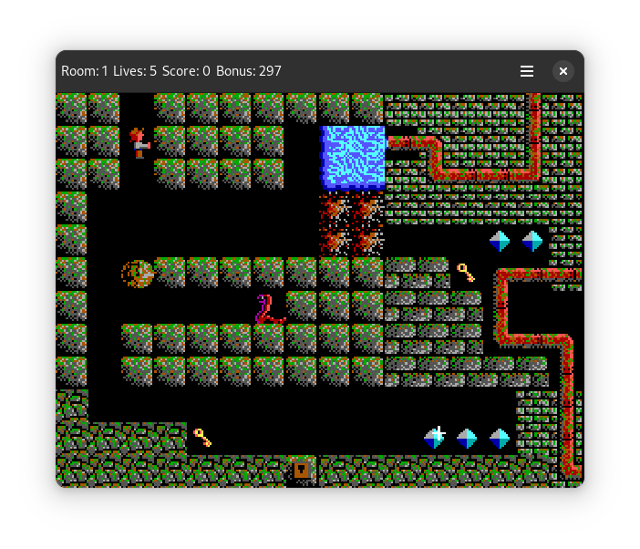

# Tribute to Paganitzu

This repository has been moved to https://codeberg.org/jwharm/tribute-to-paganitzu

---

**Tribute to Paganitzu** is an open-source, Java-based reimplementation of the shareware episode of the classic Apogee game "Paganitzu" created by Keith Schuler in 1991 and published by Apogee. *Tribute* started out as a small tech demo for the [Java-GI](https://java-gi.org) and [Cairo language bindings](https://github.com/jwharm/cairo-java-bindings), but I gradually added all features necessary to play the entire Paganitzu shareware game.

